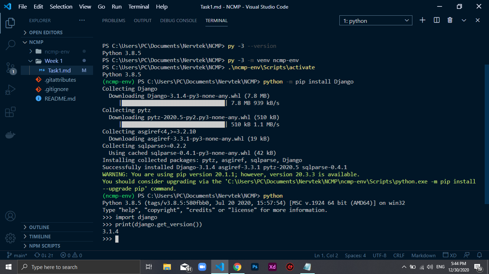

# Steps
This commands will be abit different on Linux and Mac OS

1. After installing python check it is installed by printing out the version
`py -3 --version`
2. The following command is used to create a virtual environment which is a python environment such that the python interpreter, libraries and scripts installed into it are isolated to the others installed on your pc.
`py -3 -m venv env-name`
3. Activating your environment which means "opening it" to use
`.\env-name\Scripts\activate`
##### NB: To call python you use `python` as shown
###### Out of environment 
`py -3 --version`
###### In Virtual environment
`python --version`

4. Now install Django, this will take some minutes
`python -m pip install Django`

5. Open the python shell and import django to see if python recognises it, then print its version
- `python`
- `import django`
- `print(django.get_version())`

#### Example

